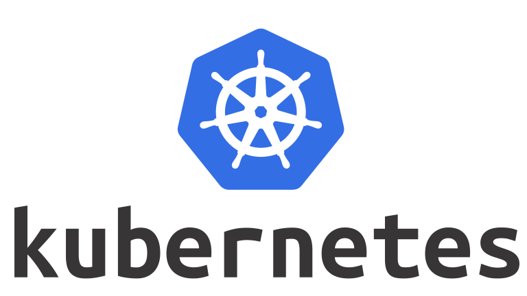

# TechSwitch's [](#) | DevSecOps 💻

## [Architecture Documentation](Architecture.md)

## [CheatSheet](cheatsheet.md)

### Other basic commands

```bash
kubectl create ns qa    # create qa namespace
namespace/qa created

kubectl create ns dev   # create dev namespace
namespace/dev created


kubectl get ns  # get the available namespaces
NAME                 STATUS   AGE
default              Active   3d15h
dev                  Active   13s
kube-node-lease      Active   3d15h
kube-public          Active   3d15h
kube-system          Active   3d15h
local-path-storage   Active   3d15h
qa                   Active   15s


kubectl create deployment k8s-tech --image=redis  --dry-run=client -o yaml > k8s.yaml  # creates a yaml output with redis image
controlplane $ cat k8s.yaml


apiVersion: apps/v1
kind: Deployment
metadata:
  creationTimestamp: null
  labels:
    app: k8s-tech
  name: k8s-tech
spec:
  replicas: 1
  selector:
    matchLabels:
      app: k8s-tech
  strategy: {}
  template:
    metadata:
      creationTimestamp: null
      labels:
        app: k8s-tech
    spec:
      containers:
      - image: redis
        name: redis
        resources: {}
status: {}


kubectl apply -f k8s.yaml     # Apply create configuration yaml
deployment.apps/k8s-tech configured

controlplane $ kubectl get deploy          # get the available deployments in default namespace
NAME       READY   UP-TO-DATE   AVAILABLE   AGE
k8s-tech   1/1     1            1           2m56s
controlplane $ kubectl get pod        # get the pods and its status
NAME                       READY   STATUS    RESTARTS   AGE
k8s-tech-7cbc78d89-8qzvj   1/1     Running   0          2m19s


controlplane $ kubectl get pod -o wide    # see more information of pods, pod ip and node it scheduled to etc
NAME                       READY   STATUS    RESTARTS   AGE     IP            NODE           NOMINATED NODE   READINESS GATES
k8s-tech-7cbc78d89-8qzvj   1/1     Running   0          3m12s   192.168.0.7   controlplane   <none>           <none>


controlplane $ kubectl run nginx --image nginx    # run nginx pod without creating deployment
pod/nginx created

controlplane $ kubectl expose pod nginx --port=80 --target-port=8080 --type NodePort  # expose or create a service with nodeport
service/nginx exposed

controlplane $ kubectl get svc        # list the services
NAME         TYPE        CLUSTER-IP      EXTERNAL-IP   PORT(S)        AGE
kubernetes   ClusterIP   10.96.0.1       <none>        443/TCP        3d16h
nginx        NodePort    10.99.168.172   <none>        80:30917/TCP   6s


# Access the nginx from browser with nodeport ip and port if you are in the same network. 

kubectl scale deploy k8s-tech --replicas 10 # creates 10 pods for same container with different IPS

kubectl get nodes -o wide # list the nodes attached to control plane with status of node

```

